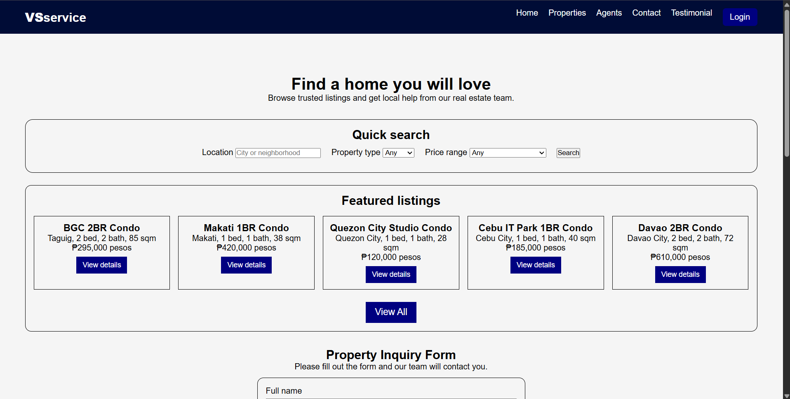
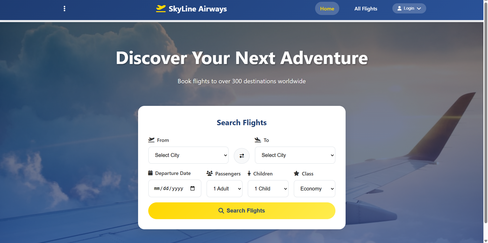

# 🌐 John Mike L. Serna — Personal Portfolio

A personal portfolio website built with **HTML, CSS, and JavaScript**, showcasing my skills, projects, and contact information as a beginner web developer.

---

## 📸 Preview

| VSService | Skyline Airways |
|-----------|----------------|
|  |  |

---

## ✨ Features

- **Responsive Design** — Works across desktop, tablet, and mobile
- **Typing Effect** — Animated role titles in the hero section
- **Smooth Scrolling** — Anchor-based navigation with smooth scroll behavior
- **Active Nav Highlight** — Navigation link updates based on scroll position
- **Animated Skill Bars** — Skill proficiency bars animate on scroll into view
- **Fade-in Animations** — Sections fade in using Intersection Observer API
- **Image Lightbox** — Project screenshots open in a fullscreen dialog
- **Contact Form Validation** — Client-side validation with inline error messages
- **Back-to-Top Button** — Appears after scrolling down 400px
- **Hamburger Menu** — Collapsible nav for mobile screens

---

## 🛠️ Tech Stack

| Technology | Purpose |
|------------|---------|
| HTML5 | Semantic page structure |
| CSS3 | Styling, Flexbox, Grid, animations |
| JavaScript (Vanilla) | Interactivity, DOM manipulation |
| Font Awesome 6 | Icons |
| Google Fonts (Syne, DM Sans) | Typography |

---

## 📁 Project Structure

```
portfolio/
|_____HTML
        ├── index.html          # Main HTML file
        ├── css/
        │   └── style.css       # All styles
        ├── js/
        │   └── script.js       # All scripts
        └── images/
        |   ├── skyline.png     # Skyline Airways project screenshot
        |    ├── vsservice.png   # VSservice project screenshot
        |    └── icons/
        |        └── gmail.svg   # Gmail icon
        |__Readme.md
```

---

## 🚀 Projects Featured

### 1. VSservice — Real Estate Listings
A property listing web application where users can search and browse real estate listings by location, type, and price range.

**Tech:** HTML · CSS · JavaScript · PHP

### 2. Skyline Airways — Flight Booking
A flight booking interface where users can search flights between cities, choose passengers, travel class, and departure date.

**Tech:** HTML · CSS · JavaScript · PHP

> 📂 Both projects are part of this same repository.

---

## 🏃 Getting Started

Clone the repository and open `index.html` in your browser — no build tools or dependencies required.

```bash
git clone https://github.com/stevewolf0927/Web-System.git
cd Web-System
# Open index.html in your browser
```

---

## 📬 Contact

| | |
|--|--|
| **Name** | John Mike L. Serna |
| **School** | STI College |
| **Email** | [gigajohn123@gmail.com](mailto:gigajohn123@gmail.com) |
| **Phone** | +63 989 789 3412 |
| **GitHub** | [@stevewolf0927](https://github.com/stevewolf0927) |

---

## 📄 License

This project is open source and available for personal and educational use.

---

<p align="center">Crafted with ❤️ and code by John Mike L. Serna</p>
